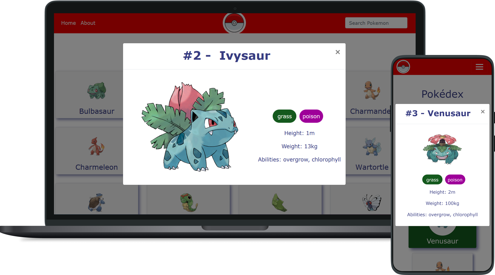

# Pokédex App - (JavaScript App)

&nbsp;

&nbsp;

Following the principal learning by doing, this Pokedex App was built to get a better understanding of javascript.
Creating this app was part of my [CF Full-Stack Web Development Program](https://careerfoundry.com/en/courses/become-a-web-developer/).

Live Demo [here](https://almanowski.github.io/pokedex-app/).

&nbsp;

## 📝 Objective
To build a small web application with HTML, CSS, and JavaScript that loads data from an external API and enabled the viewing of data points in detail.

&nbsp;

## 🗝️ Key Features
* Load data from an external source ([Pokédex API](https://pokeapi.co/))
* View a list of Pokémon
* On user action (e.g., by clicking on a list item), view details for that Pokémon (name, image, type, height, weight, and abilities)
* Search Pokémon by name

&nbsp;

## 💻 Technologies Used 
* HTML, CSS, JS
* Bootstrap 4.3.1
